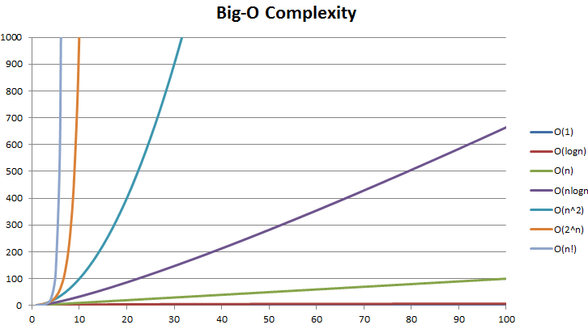

## Objectives

* Motivate for the need to something like Big O Notation
* Describe what Big O Notation is
* Simplify Big O Expressions
* Define time complexity and space complexity
* Evaluate time complexity and space complexity of different algorithms using Big O Notation
* Describe what logarithm is

## What is the idea of Big O Notation?

Imagine we have different implementation of a problem. Instead of saying that an implementation is:

* Great!
* Good
* Only OK
* Bad

We will have a numerical representation of the performance of the code this is what Big O Notation will give us.

### Who Cares?

Some of you will wondering why it's matter to compare those implementations if all of them work. Depending on the project and the context that's true but when we talk about interviewing, code challenges or working on a large company where working on a huge data set. One algorithm implementation could save an hour every time it runs compared to another implementation.

Let's take a look at an example

Suppose we want to write a function that calculate the sum of all numbers from 1 up to some number n.

**First implementation**
```js
function addUpToFirstImplementation(n) {
  let total = 0
  for (let i = 1; i <= n; i++) {
    total += i
  }
  return total
}
```

**Second implementation**
```js
function addUpToSecondImplementation(n) {
  return n * (n + 1) / 2
}
```
### Which one is better?

What does better mean:
* Faster
* Less memory-intensive
* More readable

Let's focus on speed now.
For our exemple if we want to know which implementation is more faster, the simplest way is to use built in timing function, something like this.

```js
  const n = 10000000000

  const t1FI= performance.now()
  addUpToFirstImplementation(n)
  const t2FI = performance.now()
  const timeElapsedFI = t2FI - t1FI

  const t1SI = performance.now()
  addUpToSecondImplementation(n)
  const t2SI = performance.now()
  const timeElapsedSI =  t2SI - t1SI

  if (timeElapsedFI < timeElapsedSI) {
    console.log('The first implementation is faster than the second one')
  } else if (timeElapsedFI > timeElapsedSI) {
    console.log('The second implementation is faster than the first one')
  } else {
    console.log('The first and the second implementation have the same speed')
  }
  // -> output: The second implementation is faster than the first one
```

The problem of this comparison is that:

* Different machines will record different times
* The same machine will record different times
* For fast algorithms, speed measurements may not be precise enough

That doesn't mean that we will get the opposite result where the first solution is faster than the second one, but it means that the margin will change, the measurement will be different.

## Introducing Big O Notation

Big O Notation is a way to formalize fuzzy counting, it allows us to talk formally about how the runtime of an algorithm grows as the input grow, we won't care about the details, only the trends.

### Examples Big O Runtimes

Rather than counting the number of seconds, which are so variable... let's learning about analyzing an algorithm using Big O Notation.

### O(1)

The following functions are **O(1)** because the algorithm is not dependent on a variable size data set. In other words, regardless of the input size, the runtime of the algorithm will not grow beyond some constant size. It will be roughly the same regardless of the input.

```js
function logHelloWorld() {
  for (let i = 0; i < 100; i++) {
    console.log('Hello World')
  }
}
```

`logHelloWorld` logs a message to the console 100 times whenever it is called. This function is O(1). it doesn't have any inputs.

```js
function logSumOfTwoNumber(n1, n2) {
  console.log(n1 + n2)
}
```

`logSumOfTwoNumber` The size of the numbers (n1 and n2) doesn't affect how many additions need to be performed, so in this case the runtime isn't dependent on the size of the inputs, and this function is also O(1).

```js
function logMultiples(n) {
  for (let i = 0; i < 10; i++) {
    console.log(i * n)
  }
}
```

`logMultiples` logs the first ten multiples of the input to the console. Regardless of the size of n, however, only the first ten multiples will ever be logged. In other words, the runtime once again does not depend on the size of the input, and this function is also O(1).

### O(n)

The following algorithms are O(n), because the data set is iterated over approximately one time.

```js
function logHelloWorld(n) {
  for (let i = 0; i < n; i++) {
    console.log('Hello World')
  }
}
```

Unlike our previous `logHelloWorld` function, this one takes an argument, which controls how many times Hello World gets logged to the console. In this case, the runtime of the function should be roughly proportional to the size of n. let's take an exemple, if `n = 1`, `console.log('Hello World')` will be executed 1 time and if `n = 100`, `console.log('Hello World')` will be executed 100 times. This means that the runtime of `logHelloWorld` is O(n).

```js
function logHelloThenWorld(n) {
  for (let i = 0; i < n; i++) {
    console.log('Hello')
  }

  for (let i = 0; i < n; i++) {
    console.log('World')
  }
}
```

In the above example we loop over the data set twice. So you could say the runtime is O(n) + O(n) or O(2n). However, in big O notation, constants are ignored. So, O(2n) is equivalent to O(n). What matters is that the runtime scales in proportion to the input size, not the details of the proportional relationship.

### O(n<sup>2</sup>)
```js
function logAllPairs(n) {
  for (let i = 0; i < n; i++) {
    for (let j = 0; j < n; j++) {
      console.log(i, j)
    }
  }
}
```

```js
function bubbleSort(arr) {
  let len = arr.length
  let lastSwap
  let temp
  while (len != 0) {
    lastSwap = 0
    for (let i = 1; i < len; i++) {
      if (arr[i - 1] > arr[i]) {
        temp = arr[i-1]
        arr[i-1] = arr[i]
        arr[i] = temp
        lastSwap = i
      }
    }
    len = lastSwap
  }
}
```

In these two examples, within each element of the array, we are iterating over all elements again. Therefore, the runtime is O(n) * O(n) or O(n<sup>2</sup>).

If you see nested loops, the runtime will be O(<sup>nlevels of nesting</sup>). In other words, a function with a single for loop will be O(n), a function with a loop inside of a loop will be O(n<sup>2</sup>), a function with a loop inside of a loop inside of a loop will be O(n<sup>3</sup>), and so on. However, this rule of thumb doesn't always hold, but in the case when the inner loop or outer loop take a constant and not the input size as the following examples show

```js
function logMultiples(n) {
  for (let num1 = 1; num1 <= n; num1++) {
    for (let num2 = 1; num2 <= n; num2++) {
      console.log(num1 * num2)
    }
  }
}

function logSomeMultiples(n) {
  for (let num1 = 1; num1 < n=; num1++) {
    for (let num2 = 1; num2 <= Math.min(n, 10); num2++) {
      console.log(num1 * num2)
    }
  }
}
```

The first function, logMultiples, is O(n<sup>2</sup>). When n is 1, the function logs 1 multiple, when n is 2, the function logs 4 multiples, when n is 3, the function logs 9 multiples, and so on.

What about the second function, logSomeMultiples? It might seem like this function should be O(n<sup>2</sup>) as well, because of the inner loop. However, the runtime of the inner loop is not proportional to n. The inner loop will run a maximum of 10 times, so it is actually an O(1) operation. This means that the outer loop, which is still O(n), performs an O(1) operation for each value of num1. Therefore, logSomeMultiples is itself O(n), not O(n<sup>2</sup>).


## Simplifying Big O Expressions

When determining the time complexity of an algorithm, there are some helpful rule of thumbs for big o expressions.
These rules of thumb are consequences of the definition of big O notation.

**Constants Don't Matter**

O(2n) -> O(n)

O(1000) -> O(1)

O(12N<sup>2</sup>) -> O(n<sup>2</sup>)

**Smaller terms don't matter**
 
O(n + 10) -> O(n)

O(1000n + 90) -> O(n)

O(n<sup>2</sup> + 10n + 20) -> O(n<sup>2</sup>)

## Space Complexity

Everything we have seen so far was about time complexity and how we can analyze the the runtime of an algorithm as the size of the inputs increases.

We can also use Big o Notation to analyze **space complexity**: How much additional memory do we need to allocate in order to run the code in our algorithm?

Sometimes you'll hear the term **auxilary space complexity** to refer to space required by the algorithm, not including space taken up by the inputs, that's what we will focus on it and we will not care about inputs complexity.
Unless otherwise noted, when we talk about space complexity, technically we'll be talking about auxiliary space complexity.

## Space Complexity in JavaScript

* Most primitives (booleans, numbers, undefined, null) are constant space
* Strings require O(n) space (where n is the string length)
* Reference types are generally O(n), where n is the length (for arrays) or the numbers of keys (for objects)

Let's take a look at some examples:

```js
function sum(arr) {
  let total = 0
  for (let i = 0; i < arr.length; i++) {
    total += arr[i]
  }
  return total
}
```

In this example, `sum` takes one input, which is an array. Let's let n denote the length of the array. Note that the time complexity of `sum` is O(n), since we're looping through the array once and adding to the total. However, the space complexity is just O(1), since we only require one additional unit of space, for the number stored in total.

Here's another example:

```js
function double(arr) {
  var newArray = []
  for (var i = 0; i < arr.length; i++) {
    newArray.push(2 * arr[i])
  }
  return newArray
}
```

Here, our function `double` takes each element of the input array, doubles it, and returns a new array of doubled values. In this case, both the time and space complexities are O(n). Space complexity is larger in this case because we need n additional units of space: one for each element in the original array.

## Logarithms

We've encountered some of the most common complexities: O(1), O(n), O(n<sup>2</sup>), but there are some big o expressions that involve some more complex mathematical expressions, and something that appears more often is the logarithm **O(log n)** and **O(nlog n)**.

### So what's a logarithm?

The logarithm of a number roughly measures the number of times you can divide that number by 2 (if log base 2) before you get a value that's less than or equal to one. it is the inverse of the exponentiation.

Let's take an example:

* log<sub>2</sub>(8) = 3  -> 2<sup>3</sup> = 8
* log<sub>2</sub>(value) = exponent → 2<sup>exponent</sup> = value
  
In the following chart the X axis represents the size of the input (size of the array of data for example) and the Y axis represents a unit of time to run the program.



As you can see from the chart, the O(log n) is faster than O(n).

### Who Cares?

* Certain searching algorithms have logarithmic time complexity.
* Efficient sorting algorithms involve logarithms.
* Recursion sometimes involves logarithmic space complexity.

## Recap

* To analyze the performance of an algorithm, we use Big O Notation
* Big O Notation can give us a high level understanding of the time or space complexity of an algorithm
* Big O Notation dosen't care about precision, only about general trends
* The time and space complexity (as measured by Big O) depends only on the algorithm, not the hardware used to run the algorithm
* Big O Notation is everywhere, so get lots of practice!
  